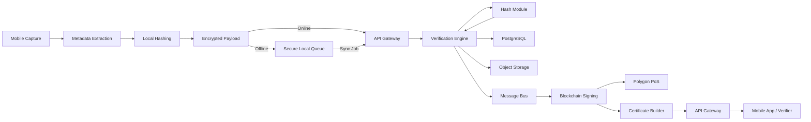
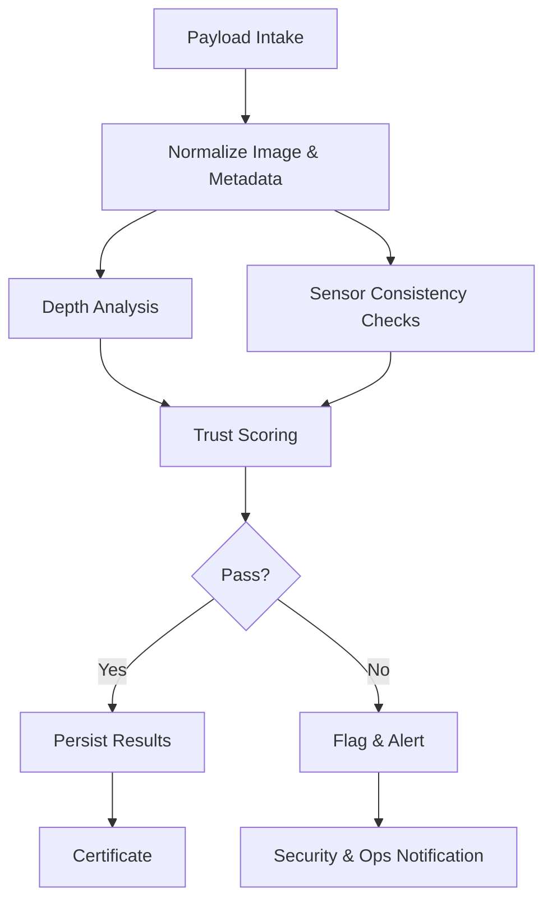
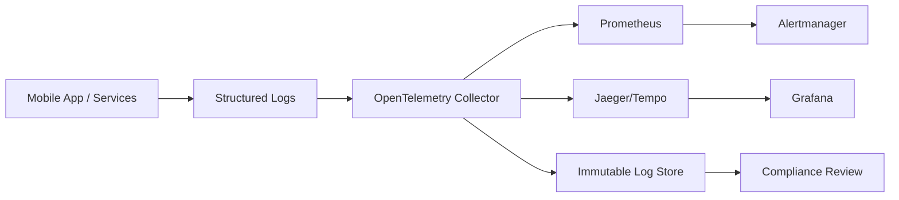

# VeriLens Data Flow Diagrams

## 1. Capture Data Pipeline

```mermaid
flowchart LR
    A[Mobile Capture] --> B[Metadata Extraction]
    B --> C[Local Hashing]
    C --> D[Encrypted Payload]
    D -->|Online| E[API Gateway]
    D -->|Offline| F[Secure Local Queue]
    F -->|Sync Job| E
    E --> G[Verification Engine]
    G --> H[Hash Module]
    H --> G
    G --> I[PostgreSQL]
    G --> J[Object Storage]
    G --> K[Message Bus]
    K --> L[Blockchain Signing]
    L --> M[Polygon PoS]
    L --> N[Certificate Builder]
    N --> O[API Gateway]
    O --> P[Mobile App / Verifier]
```

## 2. Verification Engine Internal Flow

```mermaid
flowchart TD
    Ingest[Payload Intake] --> Normalize[Normalize Image & Metadata]
    Normalize --> Depth[Depth Analysis]
    Normalize --> SensorCheck[Sensor Consistency Checks]
    Depth --> Score[Trust Scoring]
    SensorCheck --> Score
    Score --> Decision{Pass?
}
    Decision -->|Yes| Persist[Persist Results]
    Decision -->|No| Flag[Flag & Alert]
    Persist --> Certificate
    Flag --> SOC[Security & Ops Notification]
```

## 3. Observability & Audit Flow

```mermaid
flowchart LR
    Clients[Mobile App / Services] --> Logs[Structured Logs]
    Logs --> OTel[OpenTelemetry Collector]
    OTel --> Metrics[Prometheus]
    OTel --> Traces[Jaeger/Tempo]
    OTel --> Audit[Immutable Log Store]
    Metrics --> Alerts[Alertmanager]
    Traces --> Dashboards[Grafana]
    Audit --> Compliance[Compliance Review]
```
