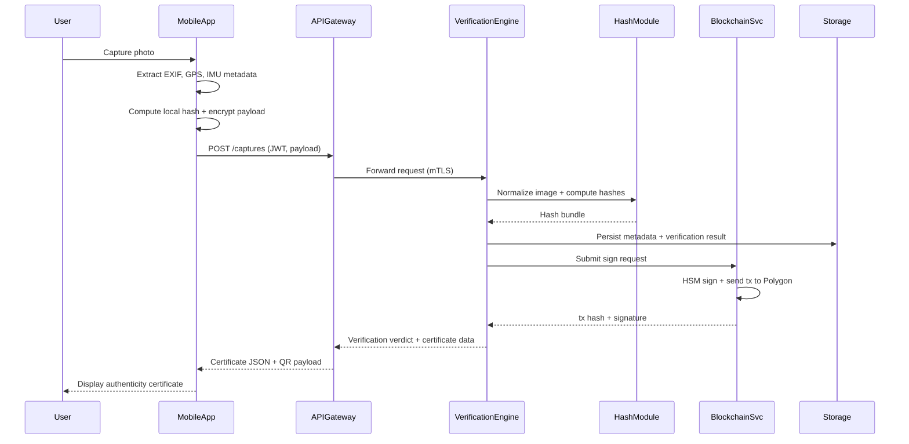
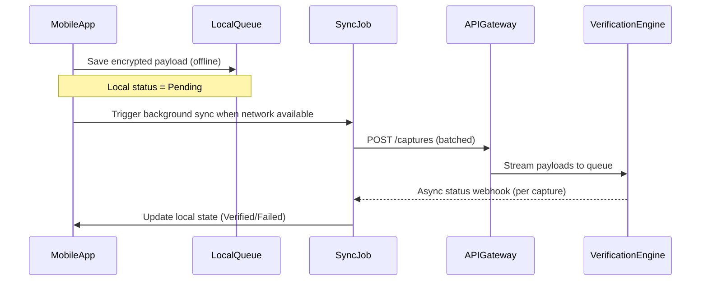
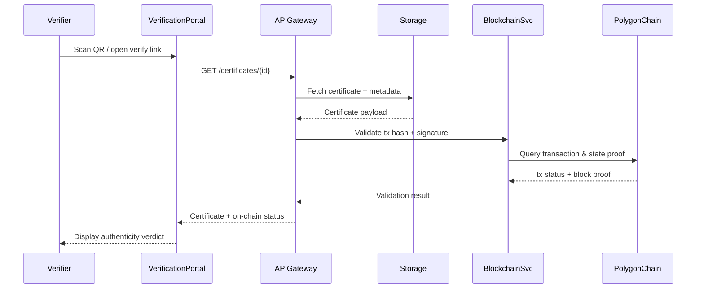

# VeriLens Sequence Diagrams

## 1. Capture → Verification → Certificate

```mermaid
sequenceDiagram
    participant User
    participant MobileApp
    participant APIGateway
    participant VerificationEngine
    participant HashModule
    participant BlockchainSvc
    participant Storage

    User->>MobileApp: Capture photo
    MobileApp->>MobileApp: Extract EXIF, GPS, IMU metadata
    MobileApp->>MobileApp: Compute local hash + encrypt payload
    MobileApp->>APIGateway: POST /captures (JWT, payload)
    APIGateway->>VerificationEngine: Forward request (mTLS)
    VerificationEngine->>HashModule: Normalize image + compute hashes
    HashModule-->>VerificationEngine: Hash bundle
    VerificationEngine->>Storage: Persist metadata + verification result
    VerificationEngine->>BlockchainSvc: Submit sign request
    BlockchainSvc->>BlockchainSvc: HSM sign + send tx to Polygon
    BlockchainSvc-->>VerificationEngine: tx hash + signature
    VerificationEngine-->>APIGateway: Verification verdict + certificate data
    APIGateway-->>MobileApp: Certificate JSON + QR payload
    MobileApp-->>User: Display authenticity certificate
```

## 2. Offline Capture Sync

```mermaid
sequenceDiagram
    participant MobileApp
    participant LocalQueue
    participant SyncJob
    participant APIGateway
    participant VerificationEngine

    MobileApp->>LocalQueue: Save encrypted payload (offline)
    Note over MobileApp,LocalQueue: Local status = Pending
    MobileApp->>SyncJob: Trigger background sync when network available
    SyncJob->>APIGateway: POST /captures (batched)
    APIGateway->>VerificationEngine: Stream payloads to queue
    VerificationEngine-->>SyncJob: Async status webhook (per capture)
    SyncJob->>MobileApp: Update local state (Verified/Failed)
```

## 3. Certificate Verification by Third Party

```mermaid
sequenceDiagram
    participant Verifier
    participant VerificationPortal
    participant APIGateway
    participant Storage
    participant BlockchainSvc
    participant PolygonChain

    Verifier->>VerificationPortal: Scan QR / open verify link
    VerificationPortal->>APIGateway: GET /certificates/{id}
    APIGateway->>Storage: Fetch certificate + metadata
    Storage-->>APIGateway: Certificate payload
    APIGateway->>BlockchainSvc: Validate tx hash + signature
    BlockchainSvc->>PolygonChain: Query transaction & state proof
    PolygonChain-->>BlockchainSvc: tx status + block proof
    BlockchainSvc-->>APIGateway: Validation result
    APIGateway-->>VerificationPortal: Certificate + on-chain status
    VerificationPortal-->>Verifier: Display authenticity verdict
```
