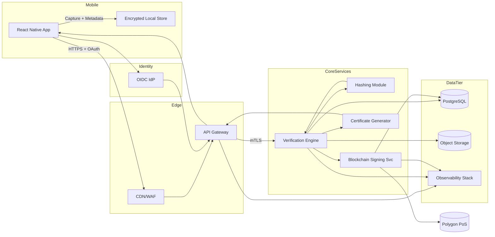

# VeriLens System Diagram

```mermaid
graph LR
    subgraph Mobile
        RN[React Native App]
        LocalStore[Encrypted Local Store]
    end

    subgraph Edge
        CDN[CDN/WAF]
        APIGW[API Gateway]
    end

    subgraph CoreServices
        VE[Verification Engine]
        HASH[Hashing Module]
        BLK[Blockchain Signing Svc]
        CERT[Certificate Generator]
    end

    subgraph DataTier
        PG[(PostgreSQL)]
        OBJ[(Object Storage)]
        LOG[Observability Stack]
    end

    subgraph Identity
        IDP[OIDC IdP]
    end

    RN -->|Capture + Metadata| LocalStore
    RN -->|HTTPS + OAuth| CDN --> APIGW
    APIGW -->|mTLS| VE
    VE --> HASH
    HASH --> VE
    VE --> PG
    VE --> OBJ
    VE --> CERT
    CERT --> APIGW --> RN
    VE --> BLK --> Polygon[(Polygon PoS)]
    BLK --> PG
    APIGW --> LOG
    VE --> LOG
    BLK --> LOG
    RN --> IDP
    IDP --> APIGW
```
